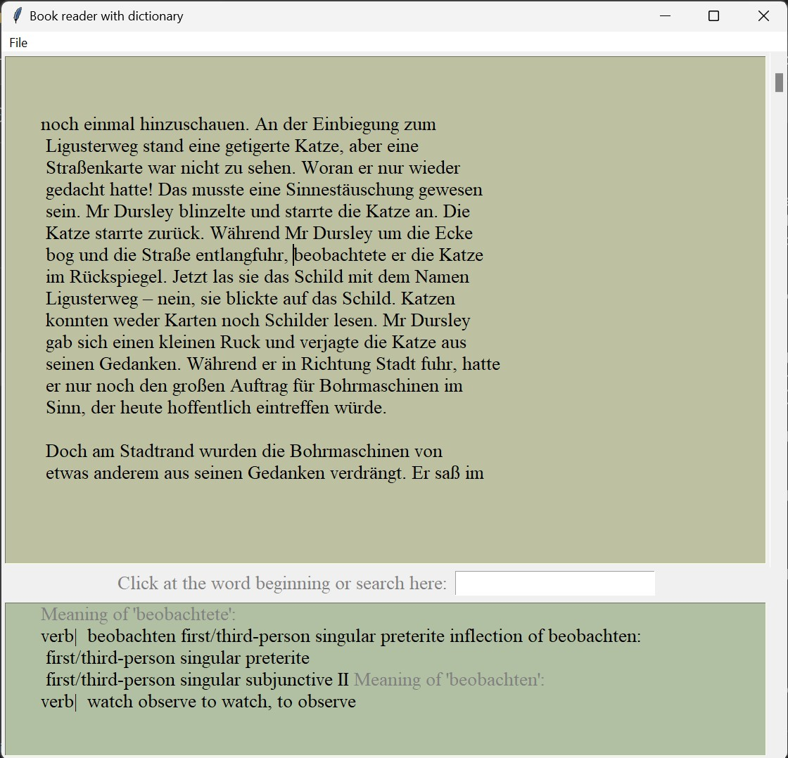

# Text Reader with a Dictionary
Read books from another language and simply click on the words to get the meaning.

## Prelogue
This project was a result of an attempt to practice two languages; German and Python.

## How to use
- The book should be in '.txt' format. You can use the file 'pdf2txt.py' to extract txt data from books in pdf format. Alternatively, you can directly download books in txt format from online platforms, eg., https://www.gutenberg.org/
- The 'dictionary' directory contains a German dictionary with 320k words. It is a simplified version of the dictionary from https://kaikki.org/dictionary/German/index.html
-  Run 'reader_dict_app.py' in python. The GUI will open. Load the desired txt using the File -> Open menu. GUI will display the book. If you click at the beginning of any of the words, its meaning will be shown in the box at the bottm. Alternatively, you can type in the words in the entry box above it and press enter. 
-  Current view of the App interface is shown below: 
<!--  -->

  

